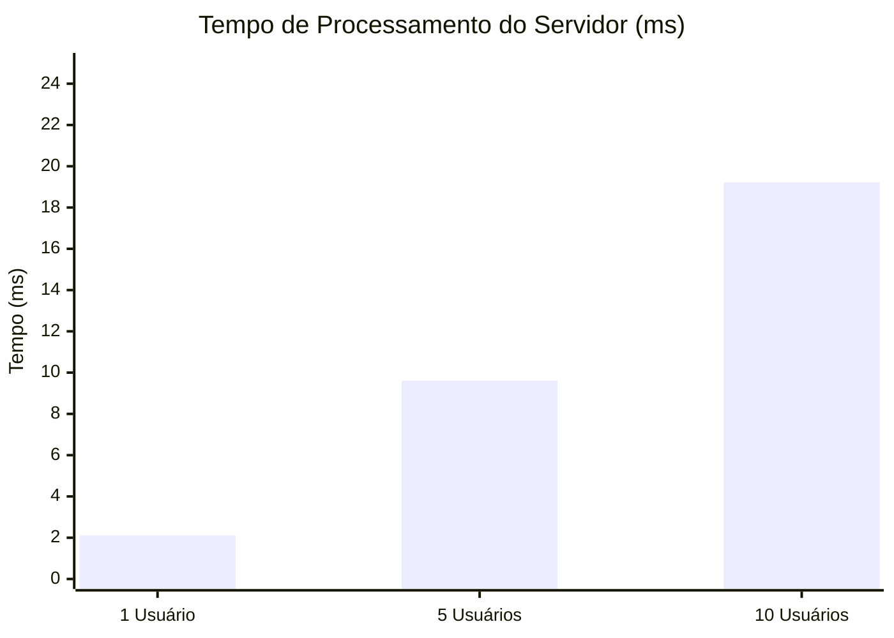
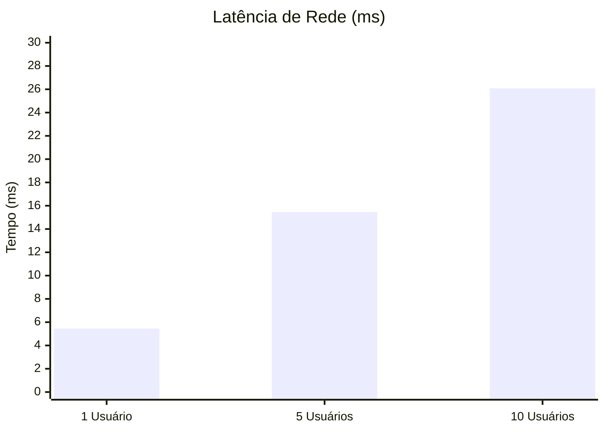
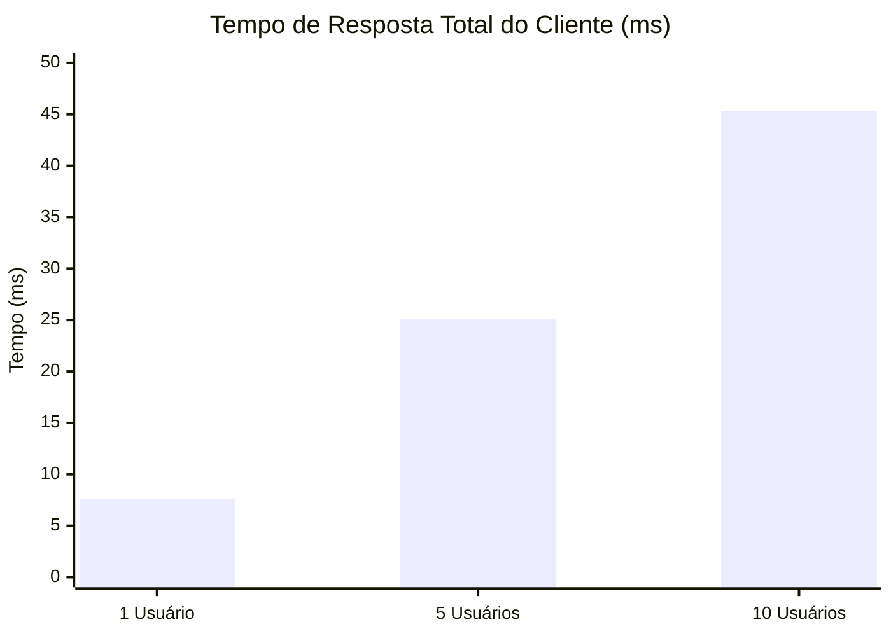

# Relatório de Carga e Performance (AV3) - SkyForge

Este relatório apresenta a análise de desempenho do sistema **SkyForge** (aeronave e gestão de produção) sob diferentes níveis de concorrência. O objetivo principal é avaliar o comportamento do sistema quando submetido a acessos de **1 usuário**, **5 usuários** e **10 usuários simultâneos**, medindo três métricas críticas: **Tempo de Processamento (Servidor)**, **Latência de Rede** e **Tempo de Resposta (Cliente)**.

---

## 1. Conceito das Métricas

De acordo com o fluxo de comunicação entre o cliente (navegador/script de teste) e o servidor (Next.js/Prisma/MySQL), as métricas são definidas da seguinte forma:

1. **Tempo de Processamento (Server-side)**:
   Refere-se ao intervalo de tempo que o servidor leva exclusivamente para processar a lógica de negócio e as consultas no banco de dados após receber a requisição. Essa métrica é independente da qualidade da conexão de rede e reflete diretamente a eficiência do código do backend e do banco de dados MySQL.
   
2. **Latência de Rede (Network RTT)**:
   Refere-se ao tempo gasto para a informação trafegar pelo canal físico de comunicação de rede (ida e volta). Ela envolve o tempo que a requisição leva para ir do cliente ao servidor mais o tempo que a resposta leva para voltar do servidor ao cliente. É influenciada por fatores como distância física, congestionamento e roteamento na rede.
   
3. **Tempo de Resposta (Client-side)**:
   É o tempo total percebido pelo usuário final. Ela representa a soma do tempo de processamento no servidor e a latência de rede (ida e volta):
   $$\text{Tempo de Resposta} = \text{Tempo de Processamento} + \text{Latência de Rede}$$
   Essa é a métrica mais próxima da experiência de uso real (UX), pois reflete a rapidez percebida de ponta a ponta.

---

## 2. Metodologia e Programação da Medição

Para obter dados reais e precisos em milissegundos (ms), programamos a aplicação e desenvolvemos um script de teste de carga em Node.js com as seguintes técnicas:

### A. Endpoint de Performance no Servidor (Backend)
Criamos um endpoint dedicado em `/api/perf` (localizado em `frontend/app/api/perf/route.ts`). Esse endpoint realiza uma busca completa na tabela de aeronaves e suas dependências (peças, etapas e testes) para simular uma carga de trabalho realista do sistema:
* Usamos `export const dynamic = "force-dynamic"` para garantir que o Next.js não faça cache da resposta, forçando a consulta ao banco de dados MySQL em todas as chamadas.
* Instrumentamos o código usando `performance.now()`, registrando o timestamp de início logo antes da query do Prisma e o timestamp de fim logo após. A diferença é retornada no JSON da resposta sob a chave `processingTimeMs`.

### B. Script de Teste de Carga (Cliente)
Desenvolvemos o script `test-load.js` na raiz do frontend para simular a concorrência dos usuários:
1. **Fase de Aquecimento (Warm-up)**: Dispara 10 requisições sequenciais preliminares. Isso é crucial em ambientes modernos para inicializar os pools de conexões e permitir a compilação JIT do V8/Next.js, evitando que o "cold start" distorça as médias.
2. **Simulação de Concorrência**: Utiliza `Promise.all` para disparar simultaneamente grupos de requisições de tamanho correspondente a cada cenário (1, 5 e 10 usuários simultâneos).
3. **Coleta de Métricas**:
   * O cliente marca o tempo inicial (`clientStart`) imediatamente antes de enviar a requisição HTTP e o tempo final (`clientEnd`) assim que recebe a resposta completa.
   * $\text{Tempo de Resposta} = \text{clientEnd} - \text{clientStart}$.
   * O cliente lê o `processingTimeMs` contido no JSON da resposta do servidor.
   * A latência é calculada pela diferença: $\text{Latência} = \text{Tempo de Resposta} - \text{Tempo de Processamento}$.
4. **Múltiplas Rodadas**: O teste executa 15 rodadas para cada nível de concorrência com um intervalo de 100ms entre elas, calculando a média aritmética final para cada métrica.

---

## 3. Resultados das Medições

Abaixo estão apresentados os valores médios obtidos durante as execuções de teste de carga (em milissegundos):

| Usuários Concorrentes | Tempo de Processamento (Servidor) | Latência de Rede (Média) | Tempo de Resposta (Cliente/UX) |
| :---: | :---: | :---: | :---: |
| **1 Usuário** | 2,11 ms | 5,45 ms | 7,56 ms |
| **5 Usuários** | 9,61 ms | 15,46 ms | 25,06 ms |
| **10 Usuários** | 19,22 ms | 26,08 ms | 45,30 ms |

---

## 4. Gráficos de Desempenho

Abaixo estão os gráficos construídos individualmente para cada uma das três métricas sob a escala de 1, 5 e 10 usuários concorrentes.

### Gráfico 1: Tempo de Processamento (Servidor)
Este gráfico ilustra o tempo que a aplicação levou para executar a lógica interna e realizar as queries no banco de dados MySQL.

### Gráfico 2: Latência de Rede (IDA e VOLTA)
Este gráfico apresenta o atraso correspondente ao tráfego de dados na rede (calculado pela diferença entre o tempo total de resposta e o processamento).

### Gráfico 3: Tempo de Resposta (Cliente)
Este gráfico mostra o tempo total percebido pelo usuário final de ponta a ponta (Tempo de Processamento + Latência).

---

## 5. Análise dos Resultados

1. **Escalabilidade do Banco de Dados e Servidor**:
   O tempo de processamento escalou de maneira linear e controlada, passando de **2,11 ms** com 1 usuário para **19,22 ms** com 10 usuários simultâneos. Isso demonstra que a infraestrutura do Prisma Client e o banco de dados MySQL local respondem de forma eficiente à concorrência sob baixos volumes.
2. **Sobrecarga de Rede / Fila**:
   A latência de rede medida subiu de **5,45 ms** para **26,08 ms**. Por estarmos rodando o teste em rede local (loopback localhost), essa elevação na "latência" deve-se, em grande parte, à concorrência no loop de eventos (event loop) de thread única do Node.js/Next.js que gerencia as conexões HTTP concorrentes e à fila de processamento TCP do sistema operacional.
3. **Experiência do Usuário (UX)**:
   Mesmo sob a maior carga testada (10 usuários concorrentes fazendo requisições de listagem complexa de forma totalmente síncrona), o tempo de resposta total manteve-se em excelentes **45,30 ms**. Padrões industriais de UX definem que tempos de resposta abaixo de **100 ms** dão a sensação de resposta instantânea para o usuário final, confirmando a alta performance e prontidão da aplicação SkyForge.
